# Starting up and shutting down MVS

### This demonstration will show how you can start the MVS OS with a console x3270 and TSO.

---

# Part 1: Starting Hercules & IPL

First open a Terminal console and type:
```bash
hercules -f conf/mvs.cnf
```

Then type `ipl 150` on the Hercules console to initialize the program.
- Abbreviation for **Initial Program Load** (IPL), where `150` represents the device memory address of the DASD (IBM 3350) containing the system residence volume (`MVSRES`).
- This initiates the boot process by reading the IPL bootstrap records from cylinder 0, track 0 into main storage.

<div align="center">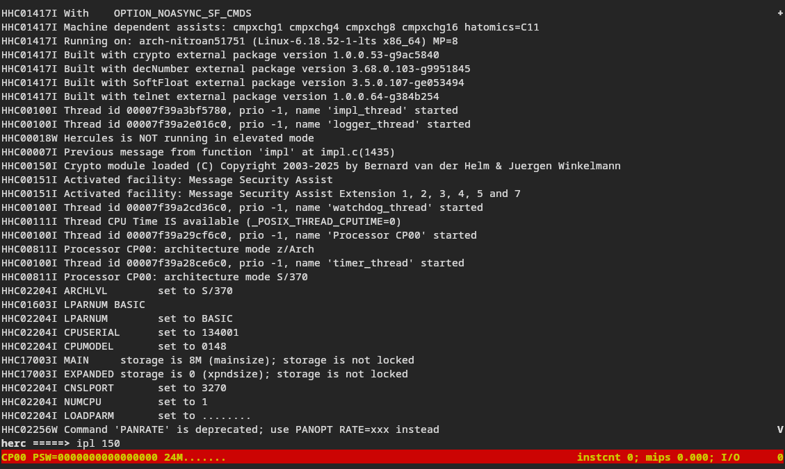</div>

---

# Part 2: Launching 3270 Terminal Emulators

To interact with the MVS operating system console and log into TSO, IBM 3270 terminal emulator sessions (`x3270`) must be launched and connected to Hercules over Telnet on port `3270`.

Open a Linux host terminal and run:
```bash
x3270 -model 3279-2 -efont "-xos4-terminus-medium-r-normal--24-240-72-72-c-120-iso10646-1" console@localhost:3270 &
x3270 -model 3279-2 -efont "-xos4-terminus-medium-r-normal--24-240-72-72-c-120-iso10646-1" tso@localhost:3270 &
```
- `-model 3279-2`: Emulates an IBM 3279 color display station (24 rows x 80 columns).
- `-efont ...`: Specifies a font, readable fixed-width bitmap font (Terminus).
- `console@localhost:3270`: Connects to device address `0010`, defined in the Hercules configuration as the **MVS Master Console**.
- `tso@localhost:3270`: Connects to the VTAM local 3270 device pool (Logical Unit / LU name `tso`), dedicated for interactive user logon sessions.

<div align="center">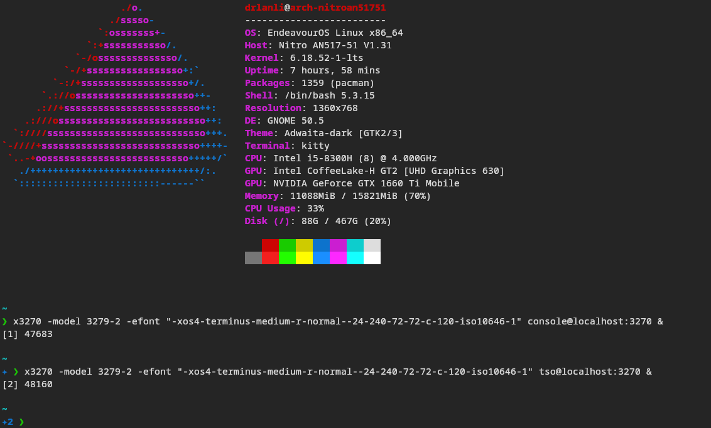</div>

Upon connection, Hercules displays its default splash screen on the terminal, confirming the emulator version (`Hyperion 4.9.1.0-SDL`), host operating system (`EndeavourOS Linux x86_64`), CPU configuration, and assigned device address (`0:0010`):

<div align="center">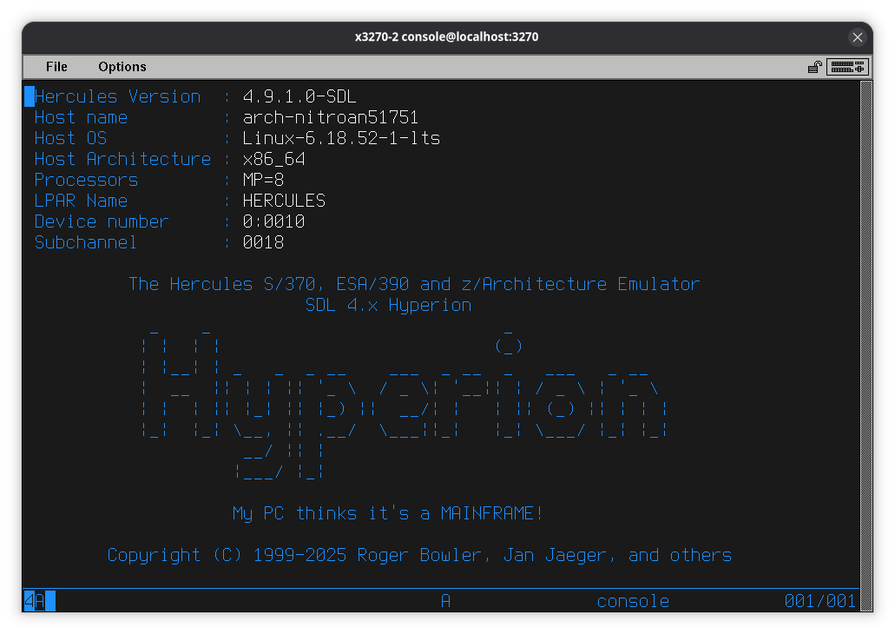</div>

---

# Part 3: MVS Boot & System Initialization Replies

During the IPL sequence, the MVS Nucleus Initialization Program (NIP) and subsystems halt and prompt the system operator on the Master Console for key startup parameters.

### 1. Specifying System Parameters (CLPA)
The system displays `IEA101A SPECIFY SYSTEM PARAMETERS FOR RELEASE 03.8 .VS2`.
Type `r 0,clpa` on the master console:
- `r 0`: Reply to prompt number `00` (or `0`).
- `clpa`: **Create Link Pack Area**. Forces MVS to read and load all operating system modules from `SYS1.LPALIB` into the Pageable Link Pack Area (PLPA) in virtual memory, guaranteeing a fresh and consistent system state.

<div align="center">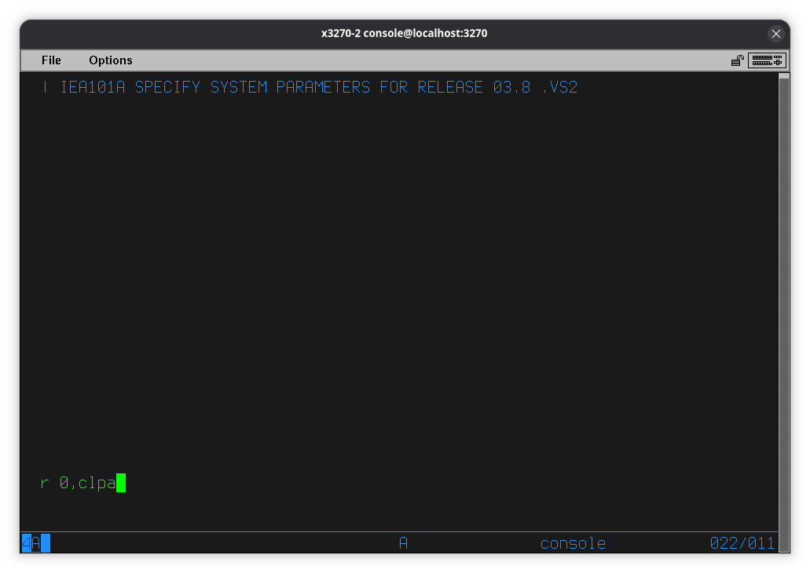</div>

### 2. Acknowledging IPL Reason
The system displays `*00 IFB010D ENTER 'IPL REASON,SUBSYSTEM ID' OR 'U'`. Simultaneously, SMF (System Management Facility) starts recording on `SYS1.MANX` and automated commands from `SYS1.PARMLIB(COMMND00)` are processed.
Type `r 0,u` on the master console:
- `u`: **Unconditional / Unspecified**. Confirms the IPL without supplying a special problem tracking code or maintenance subsystem ID.

<div align="center">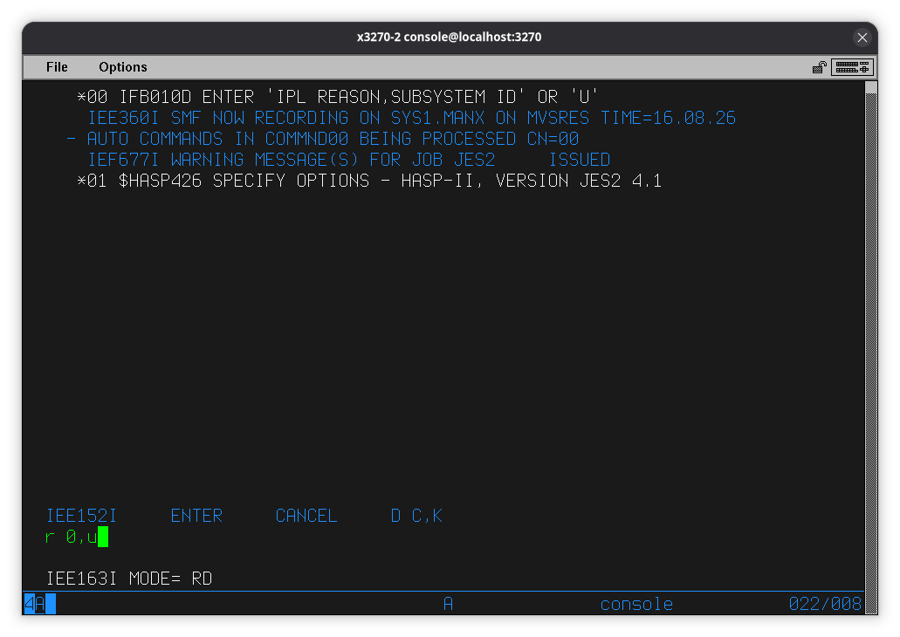</div>

### 3. Formatting JES2 Spool & Suppressing Initialization Prompts
Job Entry Subsystem 2 (JES2) begins initialization and prompts:
`*01 $HASP426 SPECIFY OPTIONS - HASP-II, VERSION JES2 4.1`.
Type `r 1,format,noreq` on the master console:
- `r 1`: Reply to prompt number `01`.
- `format`: Performs a cold start by formatting the JES2 spool dataset, clearing out any leftover jobs or temporary spool allocations.
- `noreq`: Specifies "No Request" — instructs JES2 to proceed without further operator queries, automatically applying defaults defined in the initialization parameter deck.

<div align="center">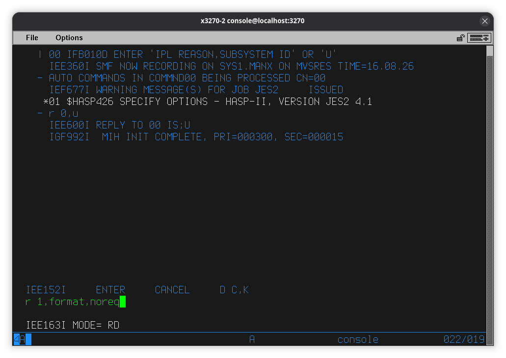</div>

### 4. Starting VTAM (Telecommunications Network)
JES2 completes its startup sequence (`$HASP099 ALL AVAILABLE FUNCTIONS COMPLETE`), and starts initiators 1, 2, and 3 for job classes `A`, `BA`, and `S`.
Type `s net` on the master console:
- `s net`: **Start NET**. Starts the Virtual Telecommunications Access Method (VTAM). VTAM manages communications with terminals and network nodes, allowing TCAS (Terminal Control Address Space) to open up interactive TSO sessions.

<div align="center">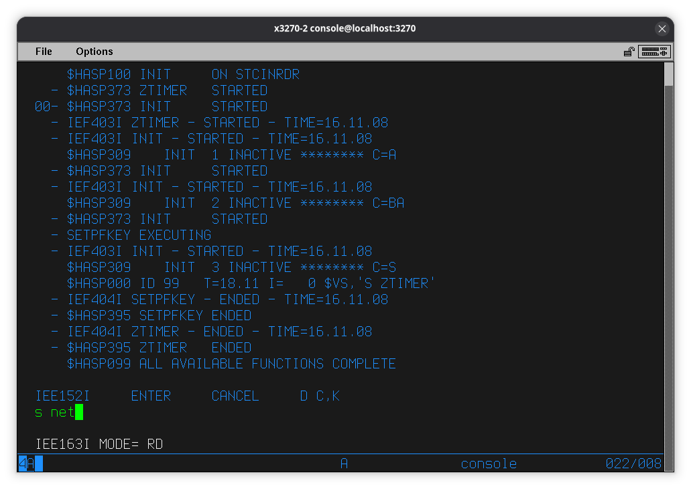</div>

---

# Part 4: Interactive TSO & RPF Session

Once VTAM and TCAS are active, users can connect to the mainframe interactively via the Time Sharing Option (TSO).

### 1. TSO Logon Screen
Switch to the user terminal (`tso@localhost:3270`). The terminal is greeted with the ASCII logo banner:
`Welcome to MVS3.8j, running under the Hercules emulator`.
The cursor sits at the input prompt: `TSO Logon ===>`.

<div align="center">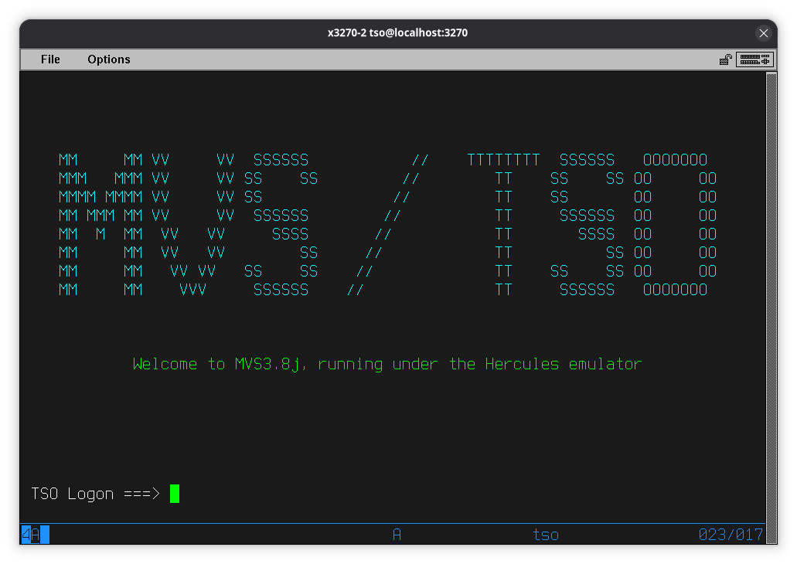</div>

### 2. Logging In
Type `logon hmvs01` at the logon prompt:
- `logon`: Initiates user session authentication.
- `hmvs01`: The default administrator user account on this MVS 3.8j system.

<div align="center">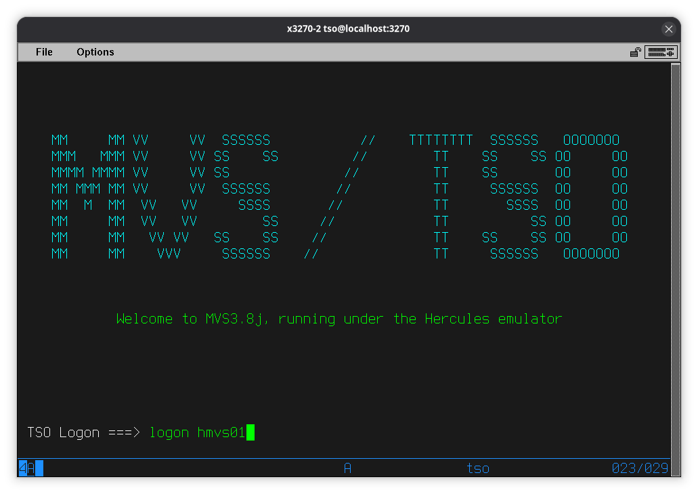</div>

### 3. Launching RPF from TSO Line Mode
After completing logon verification, TSO displays `WELCOME TO THE TSO SYSTEM` and drops into standard line mode with the `READY` prompt.
Type `rpf` at the prompt:
- `rpf`: Launches **Rob's Programming Facility** (RPF), an open-source full-screen program development tool designed specifically for MVS 3.8j.

<div align="center">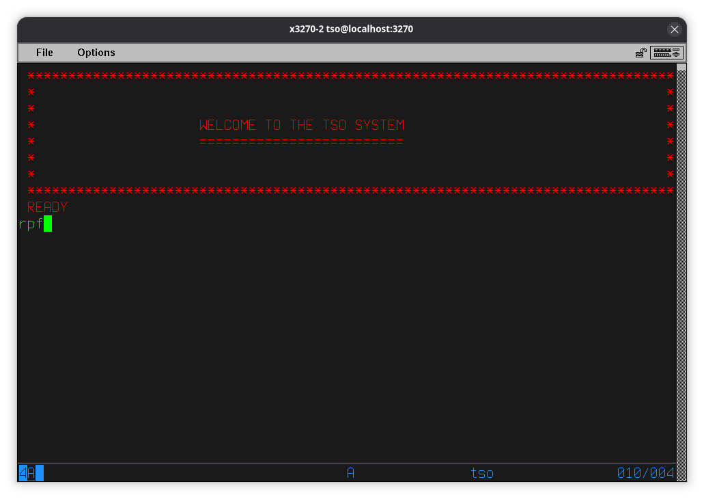</div>

### 4. Navigating the RPF Main Menu
The RPF main menu (`RPF V2R0M0`) provides an interactive interface similar to IBM ISPF/PDF:
- `0 DEFAULTS`: Configure terminal and session parameters.
- `1 BROWSE`: Browse datasets and Partitioned Dataset (PDS) members.
- `2 EDIT`: Full-screen text editor for JCL, COBOL, Assembler, etc.
- `3 UTILITY`: Manage datasets (allocate, delete, compress, rename).
- `4 ASSEMBLER`: Assemble and link programs in the foreground.
- `6 TSO`: Run TSO commands directly from RPF.
- `X EXIT`: Exit RPF.

<div align="center">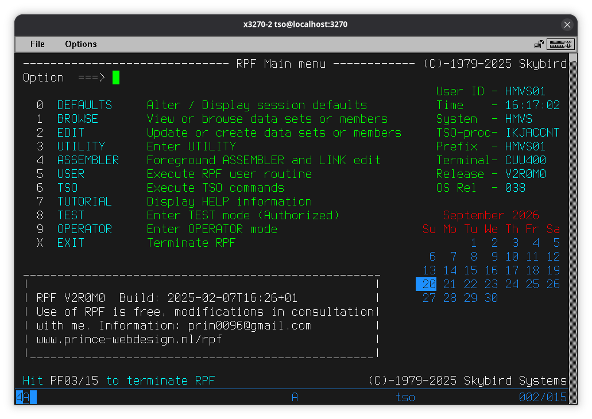</div>

### 5. Logging Off TSO
To exit RPF, press `PF3` or choose `X`. You are returned to the `READY` prompt.
Type `logoff` to end the session:
- `logoff`: Terminates the TSO session, deallocates user datasets, and frees the address space.

<div align="center">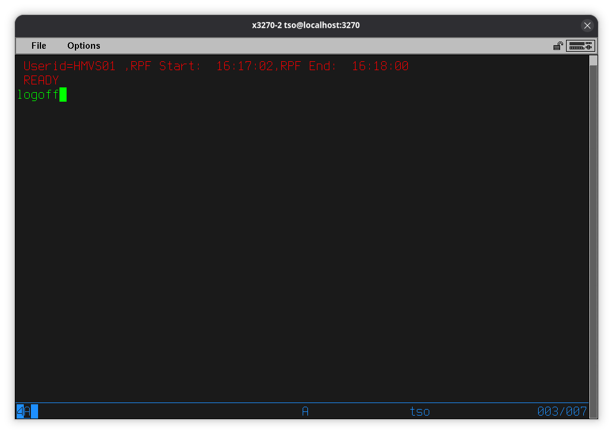</div>

---

# Part 5: Orderly Shutdown of MVS & Subsystems

Mainframes must always be shut down gracefully in reverse order of startup. Abruptly terminating Hercules can corrupt DASD volumes and VTOC tables.

### 1. Stopping TSO
On the master console, message `IEF126I HMVS01 - LOGGED OFF` confirms the user session ended.
Type `p tso` on the master console:
- `p tso`: **Purge / Stop TSO**. Stops the Terminal Control Address Space (TCAS) and prevents any new users from logging on.

<div align="center">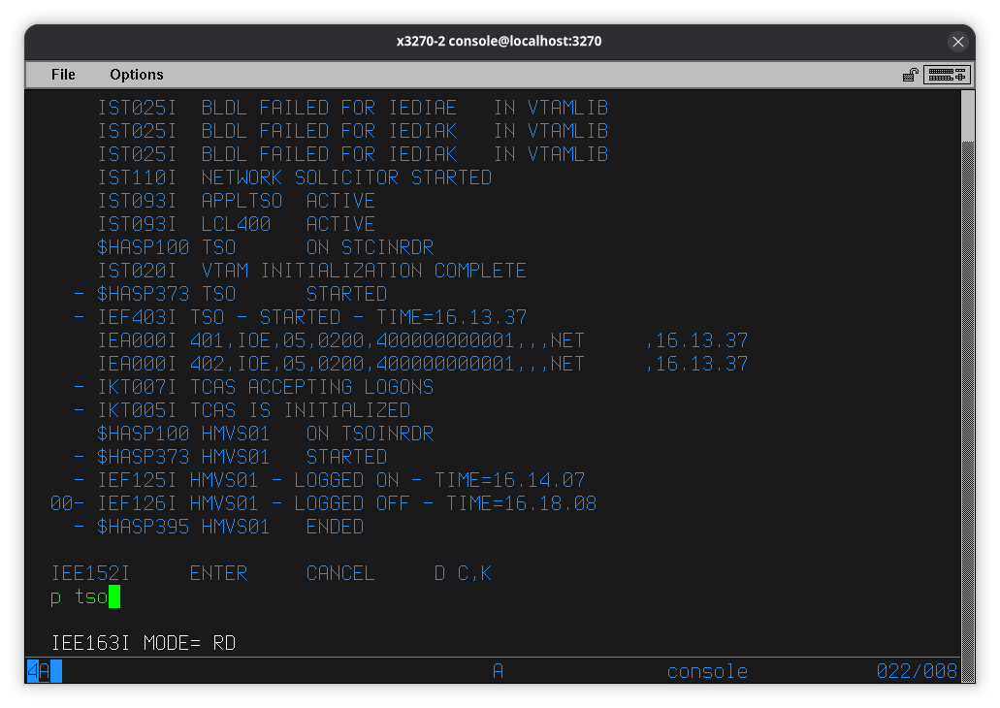</div>

### 2. Halting VTAM
The console confirms `IKT006I TCAS ENDED` and `$HASP395 TSO ENDED`.
Type `z net,quick` on the master console:
- `z net,quick`: **Halt NET Quickly**. Rapidly terminates VTAM and closes active SNA/telecommunication nodes without waiting for idle connections.

<div align="center">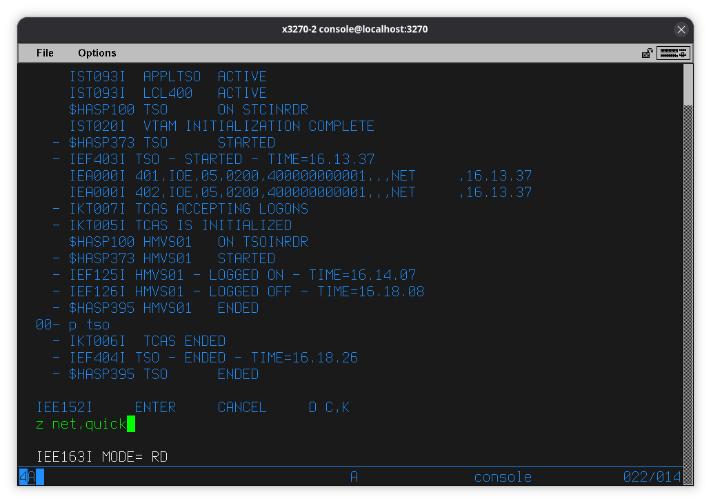</div>

### 3. Purging JES2
The console confirms VTAM has stopped (`IST102I VTAM IS NOW INACTIVE` and `$HASP395 NET ENDED`).
Type `$P JES2` on the master console:
- `$P JES2`: **Purge JES2**. Tells JES2 to drain all queues, stop active initiators, and shut down its spooling operations.

<div align="center">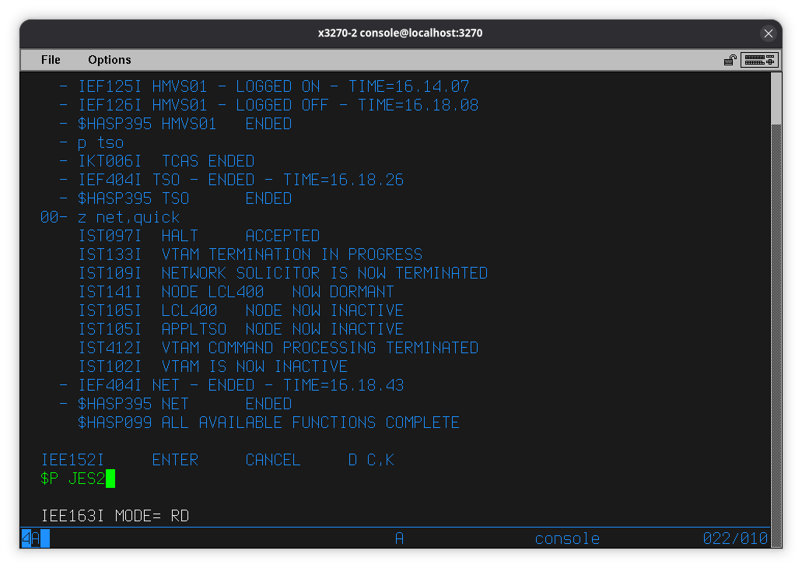</div>

### 4. Halting End-of-Day (EOD)
All batch initiators terminate (`$HASP395 INIT ENDED`) and the system log dataset is queued.
Type `z eod` on the master console:
- `z eod`: **Zero / Halt End of Day**. Flushes all buffered SMF (System Management Facility) accounting records to DASD and closes out system recording.

<div align="center">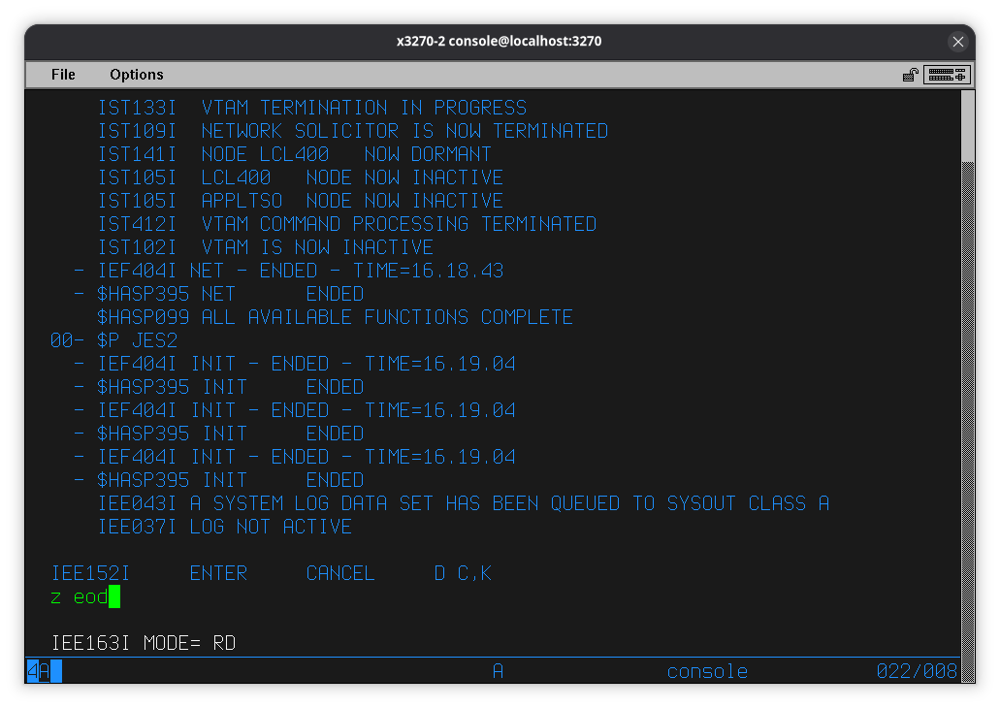</div>

### 5. Quiescing the Operating System
The console displays `IEE334I HALT EOD SUCCESSFUL`, confirming all buffers and catalog entries have been written to disk.
Type `quiesce` on the master console:
- `quiesce`: Places the CPU into a disabled wait state. The operating system halts all scheduling and instruction execution, guaranteeing that no write operations are in flight.

<div align="center">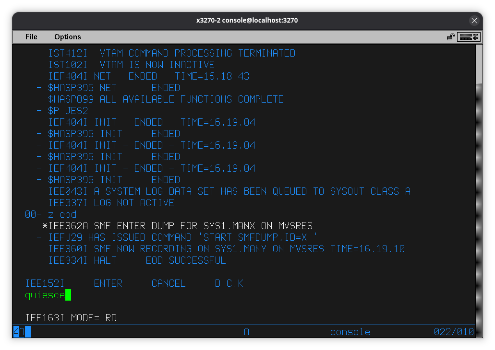</div>

---

# Part 6: Terminating Hercules EmulatorV

Return to the terminal where Hercules was launched.

Upon receiving the `quiesce` command, Hercules detects the disabled wait state and stops CPU execution:
`HHC00826W Processor CP00: processor auto-stopped due to disabled wait`
`CP00 PSW=000A000000000CCC`

Type `quit` at the Hercules prompt:
- `quit`: Safely closes all virtual DASD files, terminates active threads, and shuts down the Hercules emulator without risking filesystem or volume corruption.

<div align="center">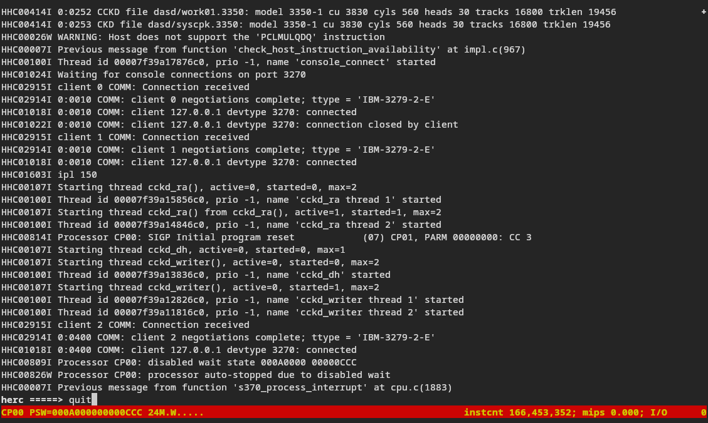</div>

## Author
Lilian Monsat

[LinkedIn](https://www.linkedin.com/in/lilian-monsat)